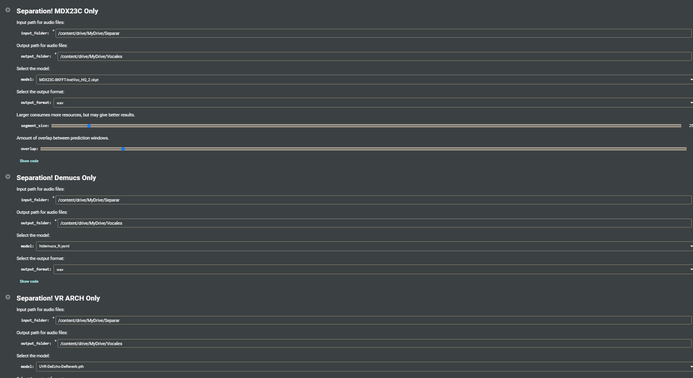

# Vocal Separation using UVR5

This is a Google Colab notebook that demonstrates how to separate vocals from audio files using the UVR5 model. The notebook is based on the work by [deezer/spleeter](https://github.com/deezer/spleeter) and [Rudrabha/Vocal-Separation-with-CUDA-Tensorcores](https://github.com/Rudrabha/Vocal-Separation-with-CUDA-Tensorcores).

## Features

- Separate vocals from audio files using the UVR5 model
- Support for both CPU and GPU (with CUDA) execution
- Efficient processing with TensorCores (if available)
- Easy-to-use interface in Google Colab

## Prerequisites

This notebook requires a Google Colab environment with GPU acceleration enabled. Additionally, you'll need to install the following dependencies:

- ffmpeg
- librosa
- tensorslow

These dependencies will be installed automatically when you run the notebook.

## Usage

1. Open the notebook in Google Colab: 
2. Connect to a GPU runtime by going to `Runtime` > `Change runtime type` and selecting `GPU` as the hardware accelerator.
3. Run the notebook cells sequentially to install the required dependencies and load the necessary files.
4. When prompted, upload your audio file or provide the path to your audio file.
5. The notebook will separate the vocals from the audio file and provide the separated audio files for you to download.

## Example

Here's an example of how to use the notebook:

## Contributing

Contributions are welcome! If you find any issues or have suggestions for improvements, please open an issue or submit a pull request.

## License

This project is licensed under the [MIT License](LICENSE).

## Acknowledgments

- [deezer/spleeter](https://github.com/deezer/spleeter)
- [Rudrabha/Vocal-Separation-with-CUDA-Tensorcores](https://github.com/Rudrabha/Vocal-Separation-with-CUDA-Tensorcores)

thanks to Eddycrack864
